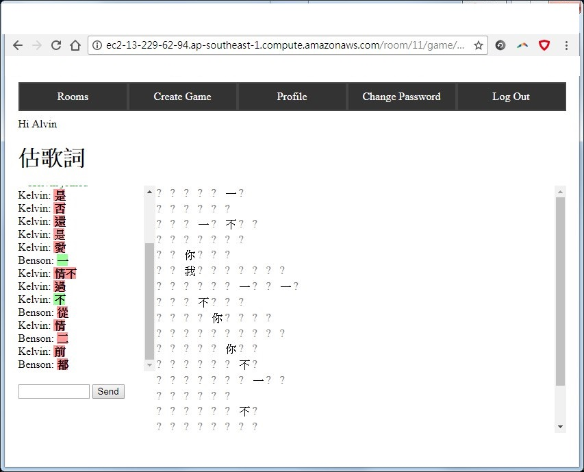
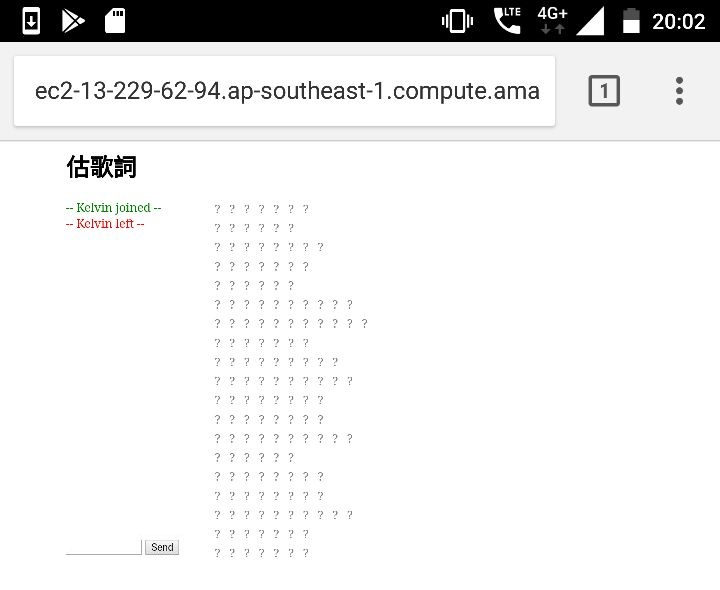

# Description
This is a multiplayer lyrics-guessing game, written in 2017. You could upload your own lyrics and invited your friends to play together to compete to complete the whole lyrics of the unknown song.

It works in mobile browser as well, there is an alert when any user joins or leaves the play arena.

# Tech stack
- Python 2 (yes it's python 2, it's so old)
- Django
- redis
- channels
- JavaScript (no front-end framework, well I didn't drill into any front-end framework, yet)

This was deployed on AWS before with apache2, I tried nginx as well but with these looked like a pain at that time, partly because this combination of tech stack was non-conventional

Docker could have been used as a whole for easy deployment
# To-Do

There should be a lot of to-dos, but I may even forget it already, I am listing the one I remember, and a very important one, it was on my first priority.
- Scoring system
# Disclaimer
Do not host it with this current repo, there are issues to be solved unless you are hosting it privately. (Well you would probably need quite an effort to setup I guess if you really want to host it)

- No throttle limits for guesses, it could spam your databases
- App Secret key is visible in the plain code for now in `multichat/settings.py`
# Postmortem
Writing this postmortem in 2024, this was actually the project I started to gain knowledge on the complete web development, well technical speaking CI/CD stuff was still not involved here. A lot of stuff was new to me and I was glad I was having fun with my friends playing for some weeks with cantonese songs. It would have been totally different if I am to rewrite it now, but I gotta focus on other things now. :D
